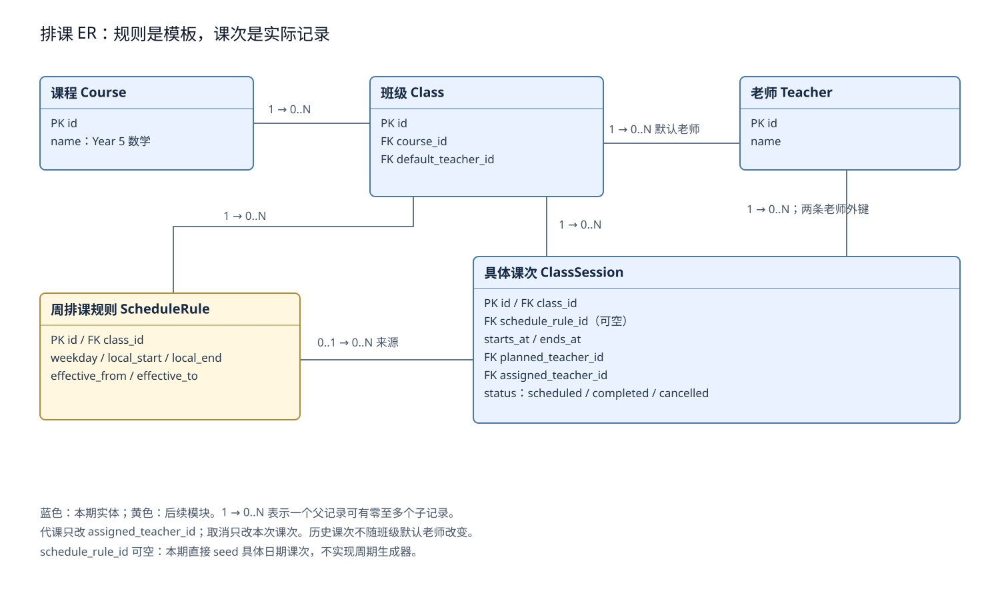
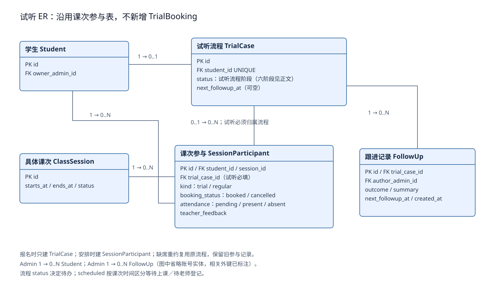
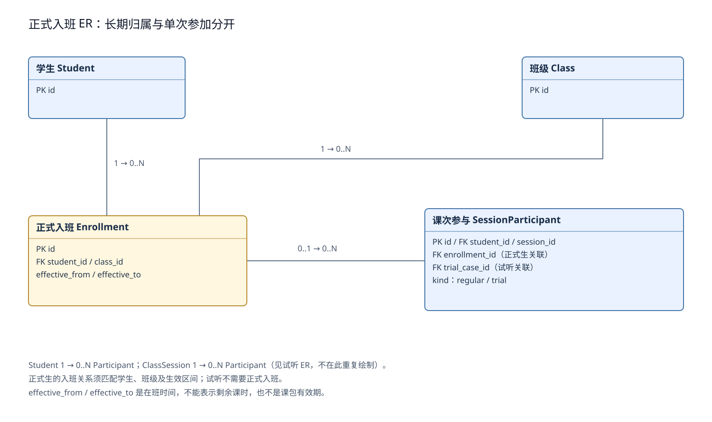
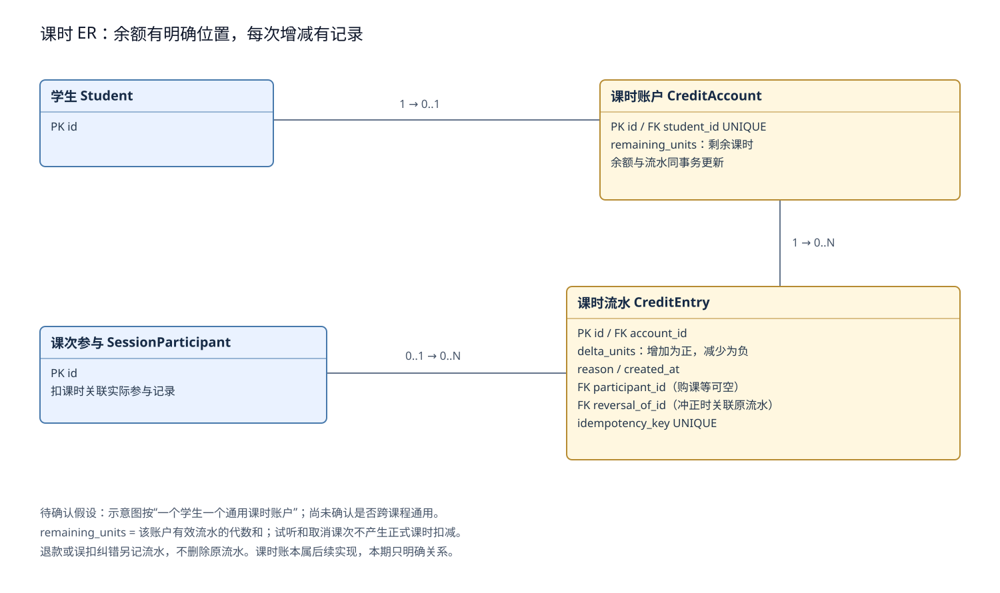

# 试听切片数据关系 v2：统一预约、排课与课时

> 仓库副本。来源：[飞书 Wiki](https://my.feishu.cn/wiki/Qoepw4h6IisXyVkb8VVcXGcynZd)，拉取于 2026-09-17，revision 9。正文保持来源表述；当前库表是否已落地以 [`db/README.md`](../db/README.md) 为准。本文不替代作业要求的 `DESIGN.md`。

设计评审稿｜2026-09-17｜适用于约 5 小时实现预算。本文是建议模型，不代表数据库已经实现，也不替代作业要求的完整 DESIGN.md。依据：父页面“数据库”、试听 Journey 与本次讨论。

## 结论与调整理由

不新增 TrialBooking。SessionParticipant 已经表示“学生预约并参加某一个具体课次”，其中 booking_status、attendance 和 teacher_feedback 分别记录预约、到课和反馈。为相同含义再建试听预约表，会让名单、时间冲突、出勤和取消处理分叉。

真正需要修改的是 TrialCase 的归属：它直接关联 Student，学生报名试听时即可创建；具体安排后，由 SessionParticipant.trial_case_id 指向它。原设计的课程、班级、课次和课次参与仍保留。

上一版把 TrialCase 必须挂在已有 Participant 下面，无法自然容纳“已报名但未安排”；随后增加 TrialBooking 是没有复用现有实体的局部修补。本版用统一参与表解决，不继续增加同义表。

## 约束与未确认假设

| 类别 | 约束或假设 |
|-|-|
| 用户已明确 | 当前每人只能试听一次，不实现“按人＋课程”的多次试听。TrialCase.student_id 唯一。 |
| 待确认解释 | 暂按实际到课一次消耗资格；缺席或机构取消不消耗，可重约。若一次指一次预约机会，只调整预约策略，不必增加表。 |
| 当前方案假设 | 每名学生一个当前负责顾问；每个课次一名实际授课老师；试听免费，不扣正式课时。 |
| 课时待确认 | 为了展示余额关系，暂画每名学生一个通用账户。是否跨课程通用尚未确认，正式实现收费前需确认。 |
| 本期非目标 | 周期自动排课、正式购课付款、财务退款、请假审批、监护人页面和完整审计模块。联系方式不纳入图。 |

## 课程、班级与具体课次

Course 是教什么；Class 是持续上课的班；ScheduleRule 是某生效期内的每周模板；ClassSession 是实际日期的一次课。具体课次保存实际起止时间，以及原定和本次授课老师。业务时间使用 Australia/Melbourne；周期规则按当地墙上时间解释，实际课次保存带时区语义的时间点。

修改未来排课规则不能静默覆盖历史记录。已有未来课次须显式调整并重新检查老师、学生冲突；本期仅 seed 具体课次，不开发规则生成器。

## 试听报名、安排与跟进

| 对象 | 职责与关键字段 |
|-|-|
| TrialCase | 一人一个试听流程：id、student_id UNIQUE、status、next_followup_at、created_at。status 记录从待安排到结束的流程阶段；报名时即可创建，不依赖具体课次。 |
| SessionParticipant | 一次具体参加安排：id、student_id、session_id、kind、trial_case_id、enrollment_id、booking_status、attendance、teacher_feedback。UNIQUE(session_id, student_id)。 |
| FollowUp | 每次联系一条记录：trial_case_id、author_admin_id、outcome、summary、next_followup_at、created_at。结果为未联系上、考虑中、有报名意向、暂不考虑。 |
| Student | 保存学生自身事实与当前 owner_admin_id；试听流程阶段属于 TrialCase，不属于学生全局状态。 |

TrialCase.status 明确管理整个试听流程，不再只区分是否结束。工作台依据 status 确定当前负责人和下一步；SessionParticipant 记录具体预约、到课和反馈事实。两者有关联的变化必须在同一事务内更新。

| status | 界面显示 | 下一步 |
|-|-|-|
| pending_schedule | 待安排试听 | Admin 选择已有课次；首次待安排和缺席后重约由参与历史区分。 |
| scheduled | 已安排试听 | 等待上课或老师登记结果；课次结束后尚未提交结果，显示“待老师登记结果”。 |
| pending_followup | 试听已完成，待跟进 | Admin 查看老师反馈并联系家长。 |
| following_up | 持续跟进中 | 到 next_followup_at 再次联系；尚未到期时显示下次时间。 |
| interested | 待办理报名 | 试听跟进结束，后续报名办理本期不实现。 |
| closed | 已结束 | 查看最后一次跟进结果和关闭原因。 |

“课次时间结束”不等于“学生完成试听”。scheduled 下根据课次 ends_at 与 attendance=pending 派生“等待上课／待老师登记结果”标签，无须定时任务改状态。只有老师确认已到课并提交反馈，才能进入 pending_followup。

| 事件 | 允许的原状态 | 更新与下一步 |
|-|-|-|
| 报名试听 | 尚无试听流程 | 创建唯一 TrialCase，status=pending_schedule；尚无 Participant。 |
| 安排试听 | pending_schedule | 写入有效 Participant(kind=trial)，status=scheduled；服务端校验时间、试听资格和冲突。 |
| 改期 | scheduled，当前预约仍有效且未到课 | 同事务取消当前有效预约并创建新 Participant；status 保持 scheduled。旧记录保留，重新校验时间冲突。 |
| 老师提交已到课及反馈 | scheduled | Participant.attendance=present 并保存反馈；TrialCase.status=pending_followup。 |
| 老师提交缺席 | scheduled | Participant.attendance=absent；按当前可重约假设，TrialCase.status=pending_schedule；原记录保留。 |
| 当前预约取消或课次取消 | scheduled | 取消仍有效且未到课的 Participant；受影响 TrialCase 回 pending_schedule，不改成缺席。已结束流程不能被旧课次取消事件重置。 |
| 未联系上／家长考虑中 | pending_followup 或 following_up | 追加 FollowUp；status=following_up，填写未来 next_followup_at。 |
| 有报名意向 | pending_followup 或 following_up | 追加 FollowUp；status=interested，清空当前 next_followup_at。 |
| 暂不考虑 | pending_followup 或 following_up | 追加 FollowUp 并记录原因；status=closed，清空当前 next_followup_at。 |

Admin 待安排数 = status=pending_schedule；待跟进数 = status=pending_followup，或 status=following_up 且 next_followup_at 已到；已预约数 = status=scheduled；待办理报名数 = status=interested。老师待处理还须检查 assigned_teacher_id=当前老师、课次未取消且已结束、有效预约 attendance=pending。

所有状态转换由服务端业务动作驱动，不提供任意修改 status 的通用接口。安排、改期、反馈、取消和跟进事务内锁定 TrialCase 并校验原状态；重复提交不得把后续阶段重置。AI 生成或保存草稿不推进流程。

## 正式入班与试听共用一次课名单

Enrollment 只解决长期在班关系；Participant 解决当次名单。formal 模式在本方案命名为 regular：kind=regular 时 enrollment_id 必填且 trial_case_id 为空；kind=trial 时反之。正式入班模块未实现前，本期只创建 trial 记录。后续加入 regular 不需要另建一套出勤表。

同一实体上保留 student_id 与来源外键是有意的：便于统一名单、唯一约束和冲突检查，但必须保证来源关系的 student_id 一致；正式入班的 class_id 也必须与课次班级一致。不可只依赖前端传值。

## 剩余课时与流水

Enrollment 的有效期表示在班时间。remaining_units 明确属于 CreditAccount，不能拿入班有效期代替余额。若后来销售按课包分别到期，需要新增 CreditPackage 及消费分摊规则，而不是把包到期日写成入班结束日。

未来购课 +20、一次正式出勤 -1、误扣冲正 +1，余额回到 20。账户余额与流水须在同一数据库事务更新；用业务幂等键拦截重复结算，锁定账户或条件更新避免并发超扣。冲正关联原流水，不能删除原记录，冲正上限不得超过原扣减。

部分课时或按分钟折算时使用统一整数最小单位或精确数值类型；不要用浮点数。资金支付和退款金额不在课时流水里混用。

## 代课、取消、重约的具体变化

| 场景 | 操作及保留的事实 |
|-|-|
| 老师临时请假顶班 | 只修改该 ClassSession.assigned_teacher_id，保留 planned_teacher_id，重新校验代课老师时间冲突；本次操作权限随 assigned_teacher_id 判断。 |
| 机构取消一节课 | 课次设 cancelled，并取消该课次仍有效且未到课的参与预约，保存取消原因；对当前 status=scheduled 且对应此预约的 TrialCase，同事务回到 pending_schedule。本次出勤不改成 absent，也不扣课时，不重置已完成试听或已结束流程。 |
| 学生缺席 | Participant.attendance=absent，保留预约和课堂事实；同事务将原 TrialCase 从 scheduled 改为 pending_schedule。按暂定规则可在同一流程下安排另一课次。 |
| 重新安排 | 仅对 pending_schedule 的 TrialCase 重新安排；新课次创建 Participant，仍指向同一流程，并同事务改为 scheduled。旧记录不删。本期不支持恢复同一学生同一课次的已取消预约，避免与 UNIQUE(session_id, student_id) 冲突。 |
| 已经实际试听 | 禁止再次预约试听。后续成为正式生时建立 Enrollment，从后续课次创建 regular 参与；不把已完成试听记录改成正式生记录。 |
| 顾问转交 | 更新 Student.owner_admin_id，权限按当前负责人；FollowUp.author_admin_id 保留历史实际操作者。 |

## 必须强制执行的规则与验证场景

| 规则 | 执行位置及验证 |
|-|-|
| 一人一个试听流程 | 数据库 UNIQUE(TrialCase.student_id)；两个请求同时报名只得到一个流程。 |
| 同一课次不重复入名单 | 数据库 UNIQUE(Participant.session_id, student_id)。 |
| 预约来源正确 | 数据库 CHECK 保证 trial/regular 对应外键互斥；服务端或复合外键保证学生及班级一致。 |
| 一次实际试听 | 预约与提交到课时锁定 TrialCase 并检查已有 present；可加 trial_case_id 在 attendance=present 下的部分唯一索引。任何纠正到课状态都需受控处理。 |
| 同一流程最多一个待处理预约 | 对同一 TrialCase 的预约写入串行化；可对 trial_case_id 在 booked 且 pending 下加部分唯一索引。课程取消同步取消待处理预约以释放该约束。 |
| 不能安排过去或已取消课次 | 服务端读取课次校验 starts_at 与 status；冲突区间用 [start,end)，背靠背不算冲突；并发时按学生锁定，改期也需同样校验。 |
| 老师只能处理自己的已结束课次 | 服务端检查 assigned_teacher_id、课次未取消、结束时间已到；重复提交结果不得重置已完成跟进。 |
| 顾问只能修改当前负责学生 | 服务端验证 owner_admin_id；包括预约、跟进、AI 草稿生成，不接受前端自行声明身份。 |
| 后续跟进时间完整 | 未联系上／考虑中必须转为 following_up 并设置未来 next_followup_at；interested/closed 清空当前 next_followup_at，历史记录保留。所有流程转换须校验原 status 并与业务事实同事务更新。 |

## 本期落地边界

本期实现 Admin、Teacher、Student、Course、Class、ClassSession、TrialCase、SessionParticipant、FollowUp。账号可在实现时合并为统一 User 加角色；图按业务角色展开，不要求两套登录系统。Course/Class/ClassSession 用 seed 初始化，用户真正操作报名试听、安排、反馈和跟进。

ScheduleRule、Enrollment、CreditAccount、CreditEntry 在本图解释扩展边界，但不要求本次实现对应管理模块。关系讨论稿不等于迁移脚本；当前只创建此文档，没有改数据库、代码或父页面。若后续落库，新增结构须通过迁移，在独立测试数据上验证后接入；失败时回退迁移与接口版本，禁止覆盖现有用户数据。

Parent 若纳入完整模型：Parent 1→N StudentGuardian，Student 1→N StudentGuardian；只描述监护关系，本期不开发。

待确认两项：一次试听是否按实际到课计算；正式课时是否全课程通用。它们不阻塞当前试听报名与安排关系的确定。
